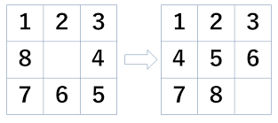

# AI-Puzzle
AI-Puzzle si pone l'obiettivo, attraverso l'uso di algoritmi di ricerca, di risolvere un puzzle composta da una griglia 3x3 contentente 8 tasselli numerati da 1 a 8.
Lo scopo del gioco è ordinare in ordine crescente i numeri servendosi del tassello vuoto per far scorrere le tessere da una posizione all'altra.

# Immagine esempio del Puzzle

#Contenuto del repository
Nel repository sono state inserite tutte le classi necessarie per la dimostrazione con una semplice demo. 
La classe di avvio della demo è GameTester, dalla quale è possibile una volta avviata inserire una sequenza di 9 numeri.

#Come utilizzare la demo
Una volta avviato il programma da GameTester sarà possibile inserire una serie di numeri.
I numeri da inserire dovranno essere necessariamente da 0 a 8. Una volta inseriti i numeri sarà possiblie scegliere quale algoritmo avviare.
Nello specifico si potrà scegliere tra: Ricerca in profondità, ricerca bidirezionale e ricercs A*.
Una volta avviato l'algoritmo calcolerà la risposta che verrà mostrata in console.
Per avviare un altro algoritmo bisognerà riavviare la demo.

Di seguito una serie di combinazioni con le quali la demo è stata testata:
- 1 2 3 4 5 6 0 7 8
- 0 1 2 3 4 5 6 7 8
- 1 3 4 0 2 5 6 7 8
- 1 2 0 7 8 6 5 3 4
- 1 2 3 4 5 0 7 8 6
